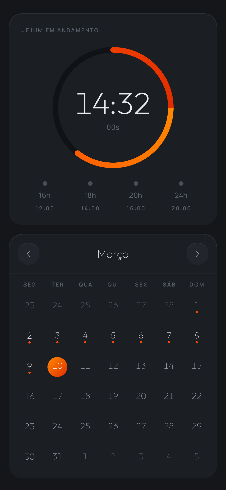
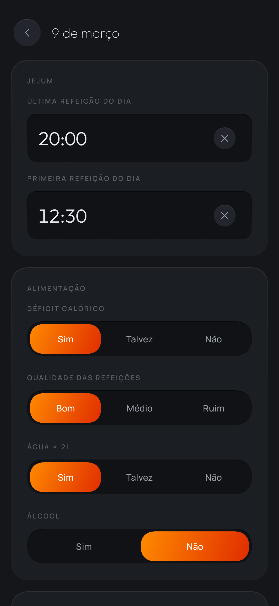
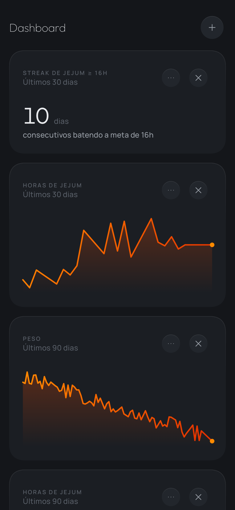
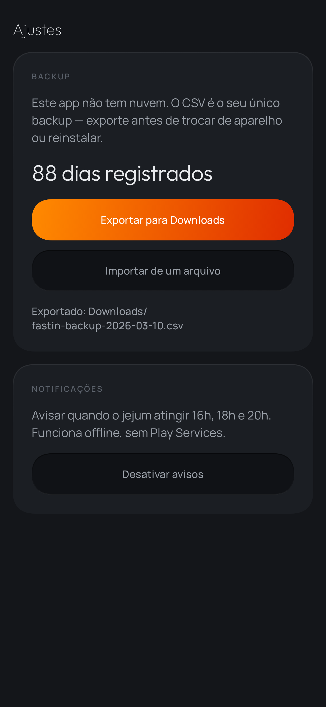

# fastin

App Android pessoal para registrar jejum intermitente, alimentação e peso — e ver isso em
gráficos. Sideload via APK, sem Play Store, sem backend, sem login, **sem internet**.

O manifesto não declara `INTERNET`. Funciona em modo avião por construção, não por promessa.

<p align="center">
  
  
  
  
</p>

> As telas acima foram renderizadas **na JVM**, não num aparelho: não existe emulador Android
> para Windows ARM64. Ver [§ Screenshots](#screenshots).

---

## O que o app faz

| Tela | O quê |
|---|---|
| **Calendário** | Mês navegável, ponto sob os dias com registro, relógio de jejum fixo no topo |
| **Registro do dia** | Horários das refeições, déficit calórico, qualidade, água, álcool, peso, observações — **todos opcionais** |
| **Relógio de jejum** | Tempo decorrido em tempo real + marcos de 16/18/20/24h com horário previsto |
| **Dashboard** | Cards configuráveis: linha, dispersão, heatmap e número grande, sobre 7 métricas |
| **Ajustes** | Export/import CSV e notificações locais dos marcos |

**A regra central:** o jejum do dia D começa na última refeição de D−1 e termina na primeira
refeição de D. Atravessa a meia-noite e respeita horário de verão — há teste para os dois.

---

## Começar

```bash
./gradlew test              # 90 testes, tudo na JVM, sem emulador
./gradlew assembleRelease   # APK em app/build/outputs/apk/release/
```

O APK release precisa de um `keystore.properties` na raiz (não versionado):

```properties
storeFile=fastin-release.jks
storePassword=...
keyAlias=...
keyPassword=...
```

Sem ele o build de release ainda roda, mas sai **sem assinatura** — então clonar o repo não
quebra nada, só não produz APK instalável.

Instalação no celular e reconstrução do ambiente: **[`docs/build-apk.md`](docs/build-apk.md)**.

---

## Stack

Kotlin · Jetpack Compose · Room · DataStore · WorkManager · Gradle KTS.

Sem biblioteca de gráficos (Canvas puro), sem framework de DI, sem Play Services, sem rede.
Cada uma dessas ausências tem um ADR explicando por quê.

---

## Arquitetura

```
ui/       Compose. Telas e design system. Sem lógica de domínio.
domain/   Kotlin puro, zero import de android.*. 100% testável na JVM.
data/     Room + DataStore. Único lugar que conhece persistência.
notify/   WorkManager para os marcos de jejum.
```

Dependência em uma direção: `ui → domain ← data`. `domain` não depende de ninguém, e nenhum
cálculo lê o relógio — todos recebem um `Clock` injetado, que é o que torna virada de dia e
horário de verão testáveis.

---

## Testes

90 testes, todos na JVM. Não precisa de emulador nem de aparelho conectado.

| Suíte | O que cobre |
|---|---|
| `FastingCalculatorTest` | virada de meia-noite, horário de verão, marcos, jejum abandonado |
| `FastingLogRepositoryTest` | round-trip no Room, upsert, campos nulos |
| `MetricEngineTest` | métricas, agregações, períodos, dado ausente ≠ zero |
| `StreakCalculatorTest` | streak, quebra de sequência, borda do dia corrente |
| `CsvBackupTest` | round-trip do backup, vírgula em `notes`, CSV corrompido |
| `MilestoneNotifierTest` | agendamento dos avisos, sem notificação retroativa |
| `CalendarScreenTest` | grade, navegação de mês, marcador de registro |
| `DayEntryScreenTest` | todos os campos opcionais, persistência pelo caminho real |
| `FastingClockTest` | relógio andando de verdade, marcos acendendo |
| `DashboardScreenTest` | cards, adicionar/remover/configurar, persistência |
| `ScreenshotTest` | render de todas as telas + geração dos PNGs |

Os testes de tela exercitam o **caminho de produção** — ViewModel real, Room real, composable
real — e cada asserção que exige um efeito tem um par que exige a ausência dele. Sem esse par,
um `save` quebrado passa para sempre: aconteceu durante o desenvolvimento e dois testes ficaram
verdes provando nada.

### Screenshots

```bash
./gradlew test --tests "*ScreenshotTest*"
```

Renderiza cada tela na JVM com 100 dias de histórico sintético e salva em `docs/screenshots/`.
Existe porque o Google não publica o emulador Android para Windows ARM64.

Não é só documentação: as telas são compostas e desenhadas de verdade, então isso é um smoke
test de renderização. Uma tela que quebrasse ao medir ou desenhar falharia aqui, e nenhum outro
teste pegaria — os demais consultam a árvore de semântica, que existe mesmo quando o desenho
falha. Foram as screenshots que revelaram que o calendário virava uma parede de laranja.

Para uma galeria navegável das seis telas:

```bash
python scripts/gen-galeria.py   # gera docs/screenshots/galeria.html
```

---

## Documentação

| Arquivo | Conteúdo |
|---|---|
| [`docs/PROJECT.md`](docs/PROJECT.md) | Fonte da verdade: escopo, modelo de dados, telas, critérios de aceitação |
| [`docs/architecture.md`](docs/architecture.md) | Camadas, fluxo de dados, o cálculo de jejum |
| [`docs/decisions.md`](docs/decisions.md) | 9 ADRs com trade-off e alternativas rejeitadas |
| [`docs/design-system.md`](docs/design-system.md) | Tokens, tipografia, sombra neumórfica, checklist de review |
| [`docs/build-apk.md`](docs/build-apk.md) | Build, sideload, ambiente, troubleshooting |

---

## Duas coisas que você precisa saber

**1. O CSV é o único backup.** Não há nuvem nem conta, e o Auto Backup do Android está
desligado de propósito (ADR-008). Exporte antes de trocar de aparelho ou reinstalar. Export e
import são simétricos e testados — o arquivo exportado reimporta sem perder nenhum campo.

**2. Guarde a chave de assinatura junto dos CSVs.** Sem ela, a próxima versão do app não
instala por cima da atual — o Android recusa update assinado por chave diferente, e
desinstalar apaga o banco.

---

## Desvios conscientes da spec original

| O quê | Por quê | Onde |
|---|---|---|
| Dark-only, não "segue o sistema" | O design de referência é exclusivamente escuro e o neumorfismo depende disso; reverter é um `lightColors()` | ADR-002 |
| Canvas em vez de MPAndroidChart/Vico | Nenhuma das duas faz heatmap nem big number — metade dos cards seria Canvas de qualquer jeito | ADR-001 |
| CSV, não PDF | PDF não reimporta; o requisito é backup, não relatório | ADR-006 |
| Sem reordenar cards por arrasto | A spec marca como opcional na v1 | `docs/PROJECT.md` §5 |

---

## Nota sobre Windows ARM64

O Robolectric não publica binário nativo para `windows/aarch64`, e uma JVM ARM64 não carrega
DLL x64. A solução está isolada onde o problema existe: **só a JVM de teste** roda em x64, via
a propriedade `fastin.testJdkX64` em `gradle.properties`. Compilação, Kotlin, KSP, R8 e o
empacotamento do APK seguem em ARM64 nativo — o APK entregue nunca passa por emulação.

Numa máquina x64, apague essa linha e tudo funciona igual. Detalhes em ADR-007.
